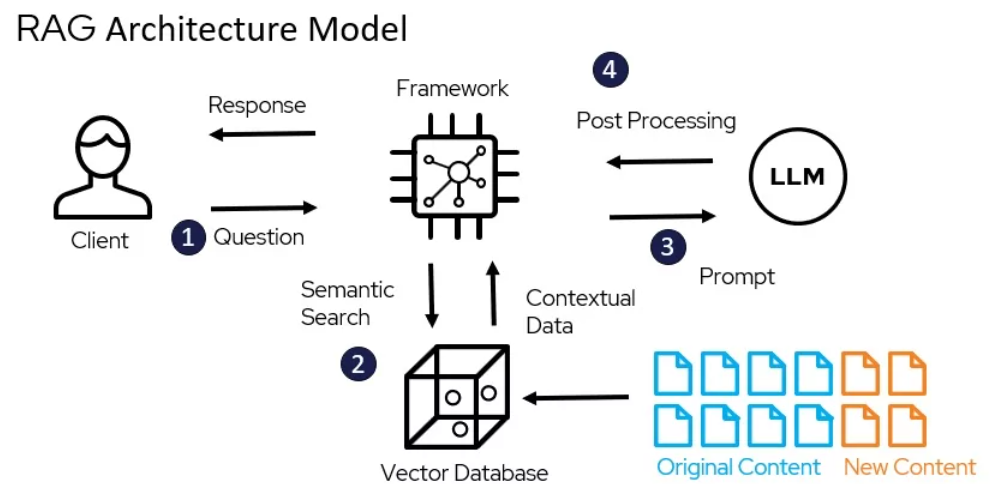

# Retrieval Augmented Generation with Memora
Have you ever wondered how AI systems generate answers to questions that seem incredibly precise and well-informed? Often, these systems rely on a technique called Retrieval-Augmented Generation (RAG). It combines the power of AI-generated content with the accuracy of relevant information retrieval. In this blog, we’ll explore what RAG is, how it works, and how you can set up a basic RAG system using a vector database.

## What is RAG?
RAG is a method that combines two important AI processes: **information retrieval** and **text generation**.

1. **Retrieval Component**: The retrieval aspect of RAG finds the most relevant information from a dataset. It uses a vector database that can quickly search and retrieve related information based on the input query.

2. **Generation Component**: The generation aspect uses an AI language model (like GPT) to create a response based on the retrieved information. This ensures that the generated content is not only creative but also informed by actual data.

Think of RAG as a highly knowledgeable assistant that, when asked a question, quickly searches through an extensive library of documents, extracts the relevant sections, and summarizes the information in a concise and coherent manner. This makes RAG ideal for tasks where both creativity and accuracy are essential, such as customer support, knowledge management, and information synthesis.

## Why is RAG Important?
Before we dive into creating our own RAG system, it’s important to understand why RAG has become such a valuable tool:

- **Accuracy and Relevance**: AI models like GPT are great at generating human-like text, but they can sometimes produce responses that are incorrect or lack context. By incorporating a retrieval step, RAG ensures that the information it uses to generate responses is accurate and grounded in real data.
- **Domain-Specific Knowledge**: Traditional AI models may not have the relevant domain-specific knowledge. With RAG, you can create a knowledge base stored in Memora, ensuring the model always has access to relevant information.
- **Real-Time Information**: AI models are trained with data beforehand and lack recent information. You can always update your knowledge base as new information comes out so that you will be up to date.  
- **Enhanced Performance**: By retrieving only the most relevant information before generating a response, RAG reduces the burden on the generation model. This can lead to faster and more efficient responses, particularly when dealing with large datasets.

## How Does RAG Work? 




Let’s explore how RAG functions in practice, step by step. We’ll look at how you can set up a basic RAG system using Memora to manage information retrieval effectively.


### Create a Collection
Memora uses collections to store data. We will create a simple collection with an additional field for storing the sentences. For more options in collection, you can check the API reference. 

```python
from memorapy import Memora
from memorapy.models import Collection, Schema, Field 

client = Memora((api_key="YOUR_API_KEY", project_id="YOUR_PROJECT_ID")

collection = Collection(
    collection_name="rag",
    dimension=512,
    schema=Schema(
        auto_id=False,
        fields=[
            Field(
                field_name="sentence",
                data_type="VarChar",
                element_type_params=ElementTypeParams(max_length=256),
            ),
            Field(
                field_name="vector",
                data_type="FloatVector",
                element_type_params=ElementTypeParams(dim=512),
            ),
            Field(field_name="id", data_type="Int64", is_primary=True),
        ],
    ),
    indexes=[
        Index(
            metric_type="COSINE",
            field_name="vector",
            index_name="vector_index",
            params=IndexConfig(index_type="IVF_FLAT", nlist=128),
        )
    ],
)

result = client.collections.create(collection=collection)

print(result)
```
    {'message': 'collection created'}

### Prepare the Data
We will use sentence_transformers library from [https://huggingface.co](HuggingFace) and get the [https://huggingface.co/jinaai/jina-embeddings-v2-small-en](Jina) AI Model for converting our sentences to vector embeddings to store inside our collection. We will store domain-specific knowledge about vectors and vector databases.

You can get sentence_transformers library in a similar way by using pip.

```shell
$ pip install sentence_transformers
```

```python
from sentence_transformers import SentenceTransformer

model = SentenceTransformer(
    "jinaai/jina-embeddings-v2-small-en", 
    trust_remote_code=True # trust_remote_code is needed to use the encode method
)
sentences = [
    "The benefits of using a vector database include faster similarity searches and the ability to handle large-scale data efficiently.",
    "Retrieval-Augmented Generation (RAG) combines information retrieval and text generation to produce accurate, context-aware responses.",
    "In a vector space, embeddings that capture similar meanings are positioned close to each other, enabling quick retrieval of relevant information.",
    "Fine-tuning a model on domain-specific data helps the AI understand the context and terminology of a particular field better.",
    "Updating the vector database regularly ensures that the system has access to the latest and most relevant information for generating responses.",
    "AI models like GPT-3 and BERT are often used to generate embeddings for transforming textual data into vectors.",
    "RAG systems are commonly used in applications like customer support, knowledge management, and information synthesis.",
    "A vector database stores information in a format optimized for similarity searches, making it ideal for retrieval tasks in AI systems.",
    "By grounding responses in retrieved data, RAG systems reduce the likelihood of generating factually incorrect information.",
    "Integrating a vector database with an AI generation model allows for dynamic, real-time responses that are informed by a large dataset."
]


embeddings = model.encode(sentences) # encode converts each sentence to its vector embedding by using jina model


print(embeddings.shape)
```
You can add the sentences and their embeddings into the collection by using the Insert method.

```python

embeddings = embeddings.tolist() # we need to convert the ndarray to list as they are not JSON serializable
data = [
    {"id": i, "vector": embeddings[i], "sentence": sentences[i]}
    for i in range(len(sentences))
]

result = client.vectors.insert(collection_name="semantic_search", data=data)

print(result)
```
    {'data': {'insertCount': 10, 'insertIds': [0, 1, 2, 3, 4, 5, 6, 7, 8, 9]}}

### Get Relevant Knowledge from Memora
As we now have our data stored in our collection, we will get the most relevant knowledge regarding our question. We will achieve it by converting the question sentence to its vector embedding and using Semantic Search inside our collection. You can also ask other questions and see the results for yourself.


```python
question = "How does Retrieval-Augmented Generation (RAG) work?"

question_embedding = model.encode([question])[0]

result = client.vectors.search(
    collection_name="semantic_search",
    data=[question_embedding],
    anns_field="vector", # name of the vector field
    output_fields=["sentence"], # fields that we want to get beside ID
    limit=3 # number of top similar sentences to return
)


print(result)

knowledge = [entity["sentence"] for entity in result["data"]]
```
    {
    "data":[
        {
            "distance":0.9473584,
            "id":1,
            "sentence":"Retrieval-Augmented Generation (RAG) combines information retrieval and text generation to produce accurate, context-aware responses."
        },
        {
            "distance":0.8453896,
            "id":8,
            "sentence":"By grounding responses in retrieved data, RAG systems reduce the likelihood of generating factually incorrect information."
        },
        {
            "distance":0.8432653,
            "id":6,
            "sentence":"RAG systems are commonly used in applications like customer support, knowledge management, and information synthesis."
        }
    ]
    }

### Generate Answer Using OpenAI
We will send our knowledge beside our question to the LLM. This step is the key difference between only using LLM and RAG.


```python
from openapi import OpenAI
openai_client = OpenAI(api_key="YOUR_OPENAI_KEY")

answer = openai_client.chat.completions.create(
    model="gpt-4o-mini",
    messages=[
        {"role": "system", "content": "You are a helpful assistant."},
        {
            "role": "user",
            "content": question + "\nAnswer the question using knowledge below:\n" + str(knowledge)
        }
    ]
)

print(answer.choices[0].message.content)
```
    "Retrieval-Augmented Generation (RAG) works by integrating two key processes: information retrieval and text generation. This approach involves retrieving relevant information from a database or knowledge source and using that information to generate accurate and context-aware responses. By leveraging rapid access to external data alongside generative models, RAG can produce responses that are more informed and relevant to the user's query, enhancing the overall quality of the output."


